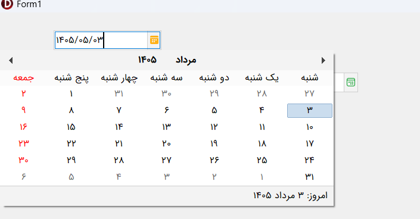
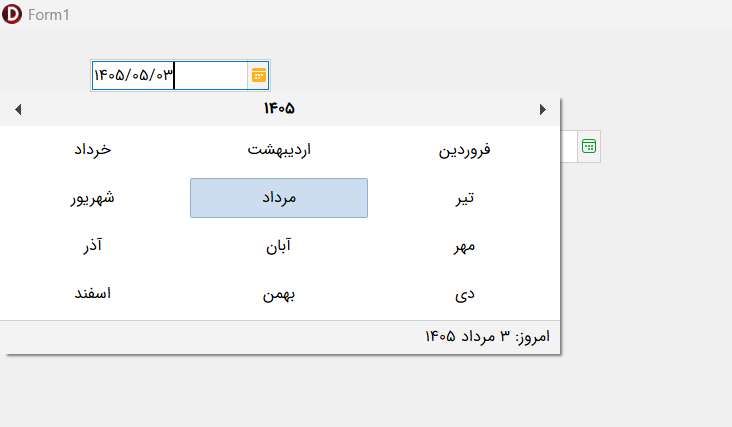
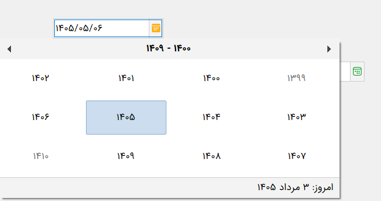
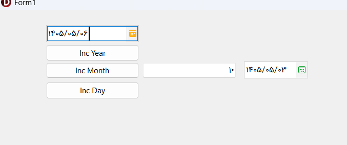
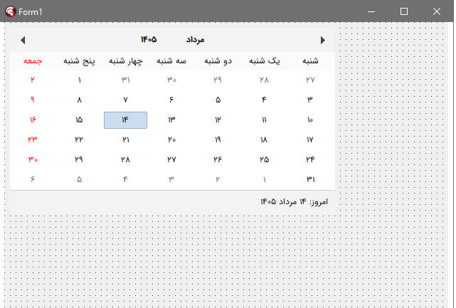

# 🗓️ Jalali Calendar

A native and stable Jalali (Persian) Date Picker component for Delphi VCL applications.

---

## 📋 Overview

`TJalaliDatePicker` is an advanced, lightweight, and dependency-free Delphi component for displaying, typing, validating, and selecting Jalali dates in VCL Windows applications.

It supports both standalone usage and full data-aware binding, making it suitable for desktop business applications, database-driven systems, and Persian-localized user interfaces.

---

## ✨ Key Features

<table>
  <tr>
    <td>✅ Native Jalali (Persian) date picker for Delphi VCL</td>
    <td>✅ Fully compatible with Delphi 12</td>
  </tr>
  <tr>
    <td>✅ No third-party dependencies</td>
    <td>✅ Supports both standalone and data-aware usage</td>
  </tr>
  <tr>
    <td>✅ Smart binding to <code>TDataSource</code></td>
    <td>✅ Compatible with both text and date database fields</td>
  </tr>
  <tr>
    <td>✅ Flexible value storage using <code>ValueMode</code></td>
    <td>✅ Direct date typing with automatic <code>/</code> insertion</td>
  </tr>
  <tr>
    <td>✅ Strict date validation on exit</td>
    <td>✅ Customizable drop-down button icons</td>
  </tr>
  <tr>
    <td>✅ Dynamic layout adjustment for different icon sizes</td>
    <td>✅ Fast navigation across day, month, year, and decade views</td>
  </tr>
  <tr>
    <td>✅ Automatically focuses the currently selected day when the popup opens</td>
    <td>✅ Built-in date increment helpers: <code>IncYear</code>, <code>IncMonth</code>, and <code>IncDay</code></td>
  </tr>
</table>

---

## 🚀 Unique Capabilities

### 🔗 Full Data-Aware Binding

The component provides a robust internal binding layer for `TDataSource`.  
It can work with database fields stored as text (`VARCHAR`, `CHAR`) or standard date types (`DATE`, `DATETIME`), while keeping the user-facing experience fully Jalali.

### 📦 Separation of Display and Storage

Using `ValueMode`, developers can choose how the value is stored in the database:

- `vmJalali`: stores Jalali date text
- `vmMiladi`: stores Gregorian date text or standard date values

Regardless of the storage format, the component always renders the date in a Persian-friendly Jalali format for the user.

### ⌨️ Direct Typing with Live Mask

Users can type the date directly without opening the popup.  
The `/` separators are inserted automatically during typing to preserve a valid date structure.

### ✅ Strict Validation on Exit

When the control loses focus, the entered date is validated against Jalali calendar rules, including:

- valid month range
- valid day count per month
- leap year rules

If the input is invalid, the component restores the last valid date to prevent corrupted data from being saved.

### 🎨 Flexible Drop-Down Icon Rendering

The component supports dynamic geometry calculations for the text area and popup button.  
If larger custom icons are used (for example `24x24`), text and button alignment remain visually correct.

### 📅 Multi-View Fast Navigation

Users can click on the month or year caption in the popup header to quickly switch between:

- day view
- month selection view
- decade/year selection view

This allows fast navigation across months, years, and larger date ranges.

### 🎯 Smart Initial Focus

When the popup opens, the component automatically locates the selected day in the calendar grid and places keyboard focus on it, allowing immediate navigation using arrow keys.

---

## 🖼️ Screenshots

<div align="center">
  <table>
    <tr>
      <td align="center">
        
        <br />
        <sub><strong>Main View</strong></sub>
      </td>
      <td align="center">
        
        <br />
        <sub><strong>Popup Calendar</strong></sub>
      </td>
    </tr>
    <tr>
      <td align="center">
        
        <br />
        <sub><strong>Month Selection</strong></sub>
      </td>
      <td align="center">
        
        <br />
        <sub><strong>Year Selection</strong></sub>
      </td>
            </td>
      <td align="center">
        
        <br />
        <sub><strong>calendar Panel</strong></sub>
      </td>
    </tr>
  </table>
</div>

---

## 📚 Properties Reference

### 🔹 Data and Value Properties

| Property | Description |
|----------|-------------|
| `Date: TJalaliDate` | Provides access to the current Jalali date as a record with separate fields such as `Year`, `Month`, and `Day`. Useful when you want to read or modify Jalali date parts individually. |
| `DateTime: TDateTime` | Synchronizes the selected Jalali date with Delphi’s standard `TDateTime` type. When this property changes, the Jalali calendar representation is updated automatically. |
| `Value: string` *(Read-only)* | Returns the final text value of the component based on the current `ValueMode`. Examples: `1405/04/20` or `2026/07/11`. |
| `ValueMode: TDateValueMode` | Defines how the component stores or exposes the date value: `vmJalali` or `vmMiladi`. |
| `DataSource` | Specifies the `TDataSource` used for data-aware binding. |
| `DataField` | Specifies the target field name in the connected dataset. |

### 🎨 Visual Properties

| Property | Description |
|----------|-------------|
| `Images: TCustomImageList` | Assign an image list for the drop-down button icon. |
| `ImageIndex: TImageIndex` | Specifies the index of the image used from the assigned image list. |
| `DropIcon: TPicture` | Allows assigning a standalone custom image directly, instead of using an image list. |
| `Font` | Controls the text font of the editor and is also reflected in the popup calendar. |
| `Color` | Controls the background color of the editor. |

---

## 📦 Requirements

- Delphi 12 or newer
- VCL Windows application

---

## 🛠️ Installation

1. Open the package project from the `Packages/Delphi12` folder.
2. Build the package.
3. Install the design-time package into the Delphi IDE.
4. Add the `Source` folder to your library path if needed.

---

## 💻 Usage

### Standalone Usage

Set the component to today’s date:

```delphi
JalaliDatePicker1.DateTime := Now;
